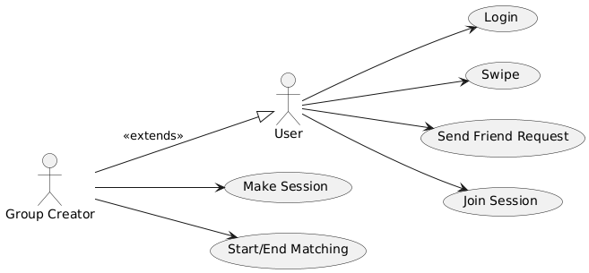
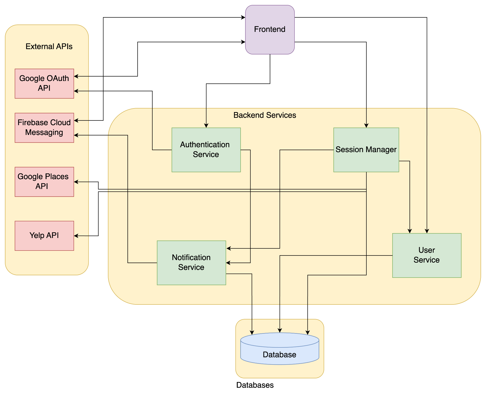
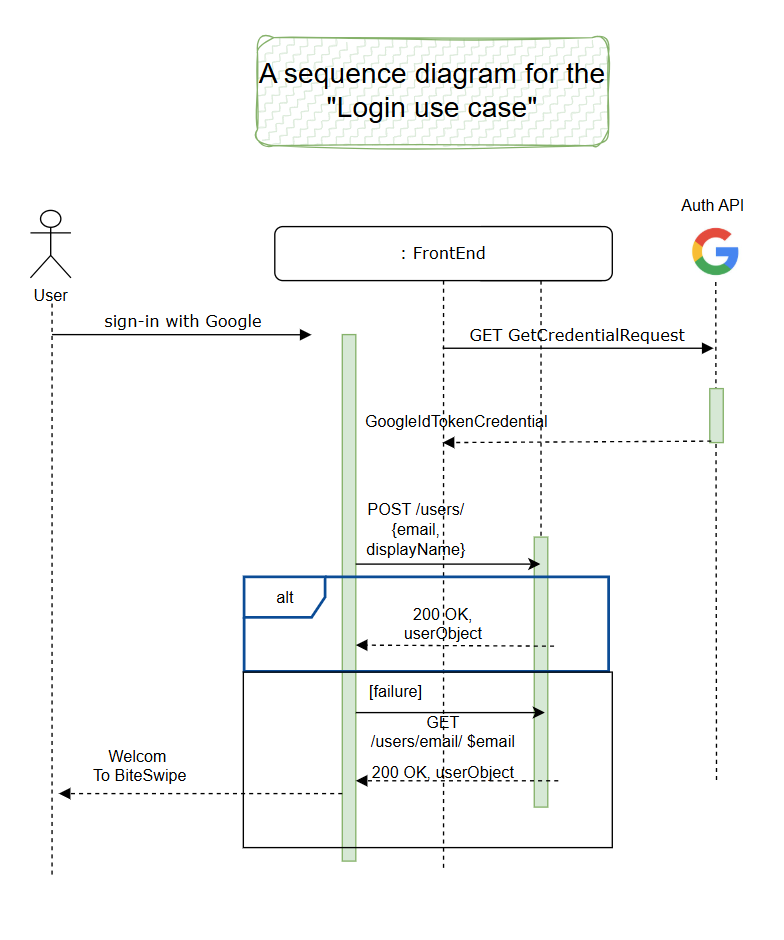
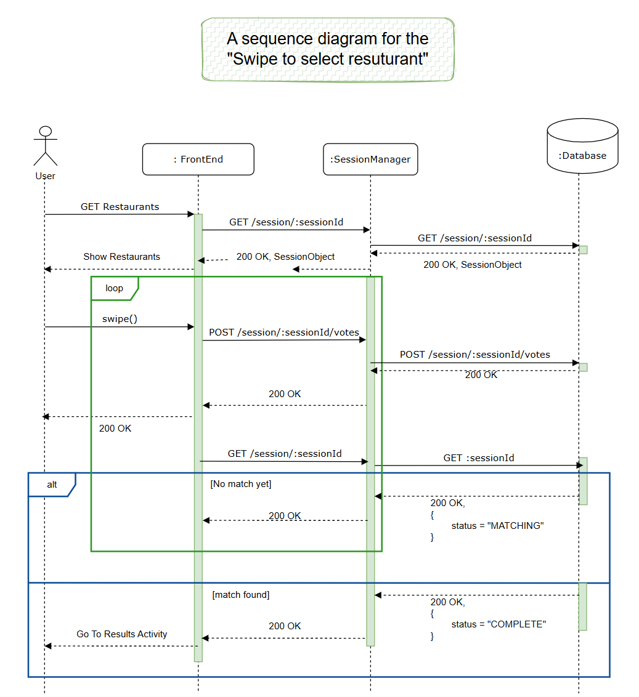
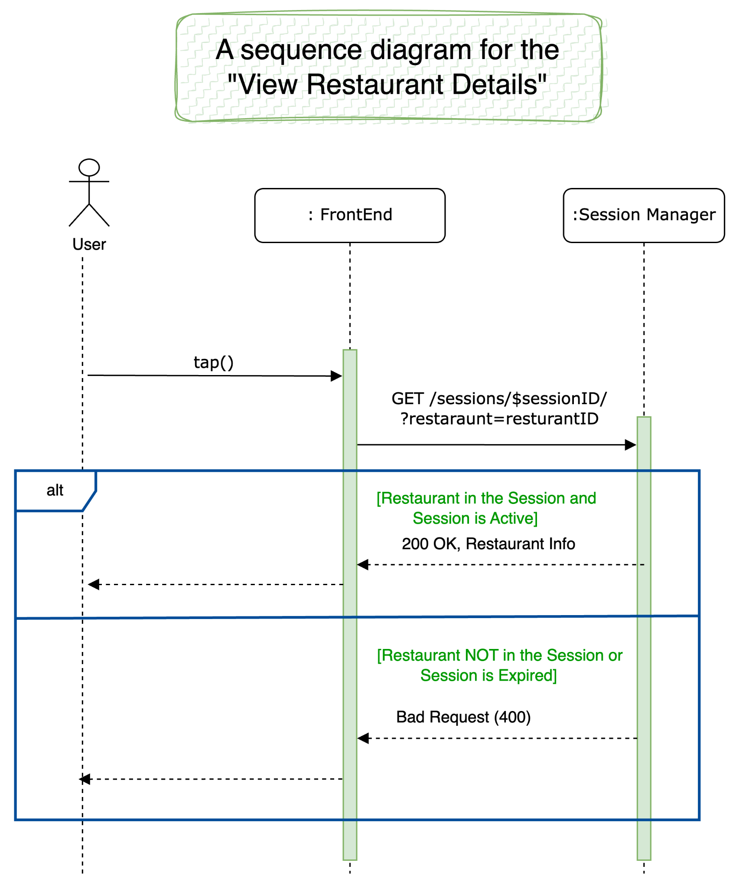
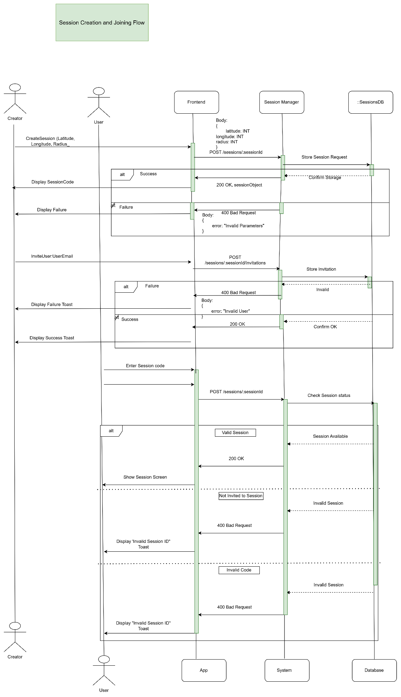
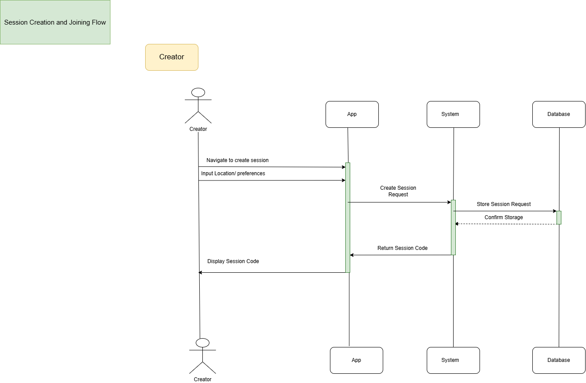
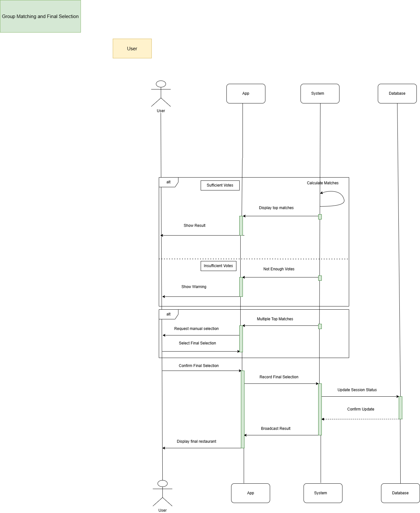
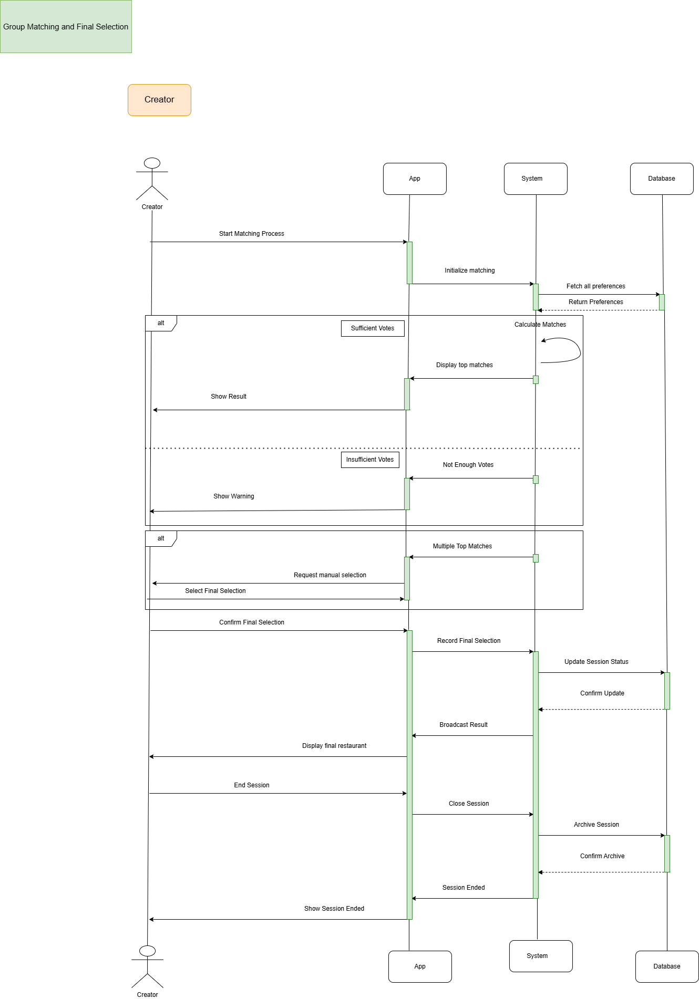

# **M5 - Requirements and Design**

## **1. Change History**

Wed, Jan 29: Creation, Formatting and typing up a document

Mon, Mar 3: Comments made for improvements

Tues, Mar 4: Edited document for submission with new architecture and
fixes from M3

Sun, April 23: Replaced view restaurant use case with add friend to more
closely align with functionality

Mon, April 31: Removed Yelp API as it was never used

## **2. Project Description**

BiteSwipe is an Android app designed to simplify choosing a restaurant
for groups of friends.

The target audience for BiteSwipe includes groups of friends, families,
and coworkers who frequently struggle with choosing a place to eat for
breakfast, lunch or dinner. Deciding on a restaurant can often be a
time-consuming and frustrating experience, with differing tastes,
preferences, and dietary restrictions making it hard to reach a
consensus. BiteSwipe addresses this issue by providing a simple,
gamified, and collaborative way to streamline restaurant selection.

In today’s busy world, people value convenience and efficiency.
BiteSwipe is designed to reduce friction and ensure that group dining
plans are decided quickly and fairly. By inviting your friends, a push
notification will be able to let them know you want to match. By
incorporating a visually engaging swiping mechanism and group voting,
BiteSwipe removes the guesswork and avoids lengthy debates, enhancing
the dining-out experience.

## **3. Requirements Specification**

### **3.1. Use-Case Diagram**

### 

### **3.2. Actors Description** 

1.   **User**: A general participant in the app who can log in, join
     group sessions, view session details, and swipe through restaurant
     options. Users collaborate with others to collectively decide on a
     restaurant.

2.   **Group Creator**: A user who creates a dining session by setting
     the location, time, and preferences. They are automatically
     included in the session and can manage the group's restaurant
     matching process.

### **3.3. Functional Requirements** 

#### **1. User Login**

  -  **Description:** The user must be able to log in and out of the
     app using **Google authentication** instead of manually entering
     credentials.

  -  **Primary actor(s):** User

  -  **Preconditions:**
    
    1.   The user has installed the application.
    
    2.   The user has an active internet connection.

  -  **Postconditions:**
    
    1.   If successful, the user is logged into the application and has
         access to personalized features.
    
    2.   If unsuccessful, the system displays an appropriate error
         message and prompts the user to retry.

  -  **Success scenario(s):**
    
    1.   The user opens the app.
    
    2.   The system displays the login screen with a "Sign in with
         Google" button.
    
    3.   The user taps the "Sign in with Google" button.
    
    4.   The system redirects the user to Google's authentication page.
    
    5.   The user selects or enters their Google account credentials.
    
    6.   The system verifies authentication with Google and grants
         access.
    
    7.   The system redirects the user back to the app, now logged in.

  -  **Failure scenario(s):**

 3a. The user denies the Google authentication request.

  -  3a1. The system returns to the login screen with a message:
     "Sign-in required."

  -  3a2. The user retries login and grants access.

 5a. Network failure during authentication.

  -  5a1. The system displays an error message: "No internet
     connection. Please try again."

  -  5a2. The user retries login once the network is restored.

 6a. Google authentication service is unavailable.

  -  6a1. The system displays an error message: "Google sign-in is
     currently unavailable."

  -  6a2. The user is advised to try again later.

#### **2. Swipe to Select Restaurants**

  -  **Description:** The user can swipe left or right on restaurant
     options, indicating interest or disinterest in a given restaurant.

  -  **Primary actor(s):** User

  -  **Preconditions:**
    
    1.   The user has installed the application.
    
    2.   The user is logged into the app.
    
    3.   The user has an active internet connection.

  -  **Postconditions:**
    
    1.   If successful, the user has swiped on a restaurant, and the
         app displays the next restaurant suggestion (if available).
    
    2.   If no restaurants are available, the user sees an appropriate
         message and cannot continue swiping.

  -  **Success scenario(s):**
    
    1.   The screen displays a restaurant suggestion, including the
         name, image, rating, and short description.
    
    2.   The user swipes right to like or left to dislike the
         restaurant.
    
    3.   The screen briefly shows a confirmation animation
    
    4.   A new restaurant suggestion appears.
    
    5.   Steps 3-5 repeat until no more restaurant suggestions are
         available.
    
    6.   If no restaurants remain, the app displays a message: "Waiting
         for other users to finish…"

  -  **Failure scenario(s):**

 1a. No restaurants are available when the user navigates to the
 selection screen.

  -  1a1. Instead of showing a restaurant, the app displays the
     message: "No restaurants available at this time."

  -  1a2. The user can exit the selection screen and return later.

4a. Network failure while loading the next restaurant.

  -  4a1. The screen displays a message: "Network error. Please check
     your connection and try again."

  -  4a2. The user can retry by tapping "Reload", or exit the screen.

#### **3. Send Friend Request**

  - #### **Description:** The user can add another user as a friend to make group making easier.

  - #### **Primary Actor(s):** User

  - #### **Preconditions:**
    
      -  The user has installed the application.
    
      -  The user is logged into the app.
    
      -  The user has an active internet connection.
    
      -  The second user has previously logged into the app.

  - #### **Postconditions:**
    
      -  If successful, the second user will appear in the friends list
    
      -  If unsuccessful, the user sees an error message and may retry.

  - ### **Success Scenario(s):**

<!-- end list -->

1.   The user is on the home page.

2.   The user clicks on the friend icon to navigate to the friends
     page.

3.   The user taps the “Add Friend” button, bringing up a text entry
     popup.

4.   The user enters the second user's email and taps the Plus button.

5.   A pop up appears stating the request was sent successfully.

 **Failure Scenario(s):**

#### 2b. Network failure while loading friends page.

  -  2b1. The screen displays a message: "No internet connection.
     Please check your connection and try again."

  -  2b2. The user can retry after restoring their internet connection.

 4b. The second user has never signed into BiteSwipe

  -  4b1. A popup appears stating the user does not exist.

  -  4b2. The user can re-enter a valid email or tap out of the Add
     Friend popup.

### **4. Join a Session**

  -  **Description:** The user can join an existing session by entering
     a join code and accessing the group member list.

  -  **Primary actor(s):** User

  -  **Preconditions:**
    
      -  The user is logged into the app.
    
      -  The user has an active internet connection.
    
      -  The user has a valid join code for an existing session.
    
      -  The user is on the home page

  -  **Postconditions:**
    
      -  If successful, the user joins the session and sees the list of
         group members.
    
      -  If unsuccessful, the user is prompted to re-enter the join
         code or try again later.

  -  **Success scenario(s):**

<!-- end list -->

1.   The user taps the "Join Group" button.

2.   The system displays a text input field labeled "Enter Join Code".

3.   The user enters a valid join code and taps "Join".

4.   The system verifies the code and processes the request.

5.   The screen transitions to the Group Members page, displaying:
    
      -  The session name
    
      -  A list of all members in the group

6.   The user is now part of the session and can participate in group
     activities.

<!-- end list -->

  -  **Failure scenario(s):  
     **4a. The user enters an invalid or expired join code.
    
      -  4a1. The system displays an error message: "Invalid or expired
         join code. Please try again."
    
      -  4a2. The user can re-enter the correct code or request a new
         one from the group creator.

  -  5a. Network failure during verification.
    
      -  5a1. The system displays a message: "Network error. Please
         check your connection and try again."
    
      -  5a2. The user can retry by tapping "Try Again" or return to
         the home page.

### **5. Create A Session**

1.   **Description:** The group creator can start a new session by
     setting the search radius from the creator’s location and cuisine
     preferences.

2.   **Primary actor(s):** Group Creator

3.   **Preconditions:**
    
    1.   The user is logged into the app.
    
    2.   The user has an active internet connection.

4.   **Postconditions:**
    
    1.   If successful, a session is created, and the group creator
         receives a join code.
    
    2.   If unsuccessful, the user is prompted to retry due to missing
         details or server errors.

5.   **Success scenario(s):**

<!-- end list -->

1.   The group creator taps the “Create Group” button from the main
     page.

2.   The screen displays input fields for:
    
    1.   Radius
    
    2.   Cuisine preferences

3.   The group creator enters the required details.

4.   The group creator taps the "Create Session" button.

5.   The system confirms session creation and displays:
    
    1.   A confirmation message
    
    2.   A unique join code for other users to join the session
    
    3.   A list of Users in the session
    
    4.   A Start Matching Button

<!-- end list -->

6.   **Failure scenario(s):**

 **  
 3a. Invalid input (missing location or preferences).**

1.   3a1. The system highlights missing fields and displays a message:
     "Please fill in the required fields."

 **5a. Server error prevents session creation.**

2.   5a1. The system displays an error message: "Unable to create
     session. Please try again later."

#### **6. Start/End Matching**

 **Description:** The group creator can initiate and finalize the
 matching process, selecting the most preferred restaurant for the
 group.
 
 **Primary actor(s):** Group Creator
 
 **Preconditions:**

1.   The user is logged into the app.

2.   The user has an active internet connection.

3.   A session has been created.

4.   At least one other user has joined the session.

 **Postconditions:**

1.   If successful, the system determines the best restaurant match and
     displays the result.

2.   If unsuccessful, the group creator is prompted to resolve the
     issue manually.

 **Success scenario(s):**

1.   The group creator taps the **"Start Matching"** button.

2.   All users are shown the matching page and swipe to select.

3.   The system displays the selected restaurant with:
    
      -  Restaurant name
    
      -  Image and description
    
      -  Address and map preview

4.   The group creator taps **"End Session"** to finalize the
     selection.

5.   The session ends, and users are notified of the final selection.

 **Failure scenario(s):  
 3a. Not enough users have voted.**

  -  3a1. The system alerts the group creator: "Not enough votes to
     determine a match."

  -  3a2. The group creator can either:
    
      -  Wait for more users to vote.
    
      -  Tap "Manually Finalize" to choose a restaurant.

 **3b. No more restaurants are available.**

  -  3b1. The system displays the message “Waiting on others to
     finish…”

  -  3b2. Once all users get this message, the system will go to
     results and display the best fit restaurant, should it exist.

 **4a. Tie between restaurants.**

  -  4a1. The system displays a message: "Multiple restaurants have
     equal votes."

  -  4a2. The system prompts the group creator to manually select a
     restaurant.

  -  4a3. The group creator selects the final restaurant.

  -  4a4. The system displays the final choice.

### **3.4. Non-Functional Requirements**

1.   **Availability/Uptime**
    
      -  **Description:** The app should maintain a minimum uptime of
         80%, allowing for occasional maintenance downtime while
         ensuring accessibility.
    
      -  **Justification:** This ensures users can create and join
         sessions without frequent disruptions. 70% uptime equates to
         \~146 hours of downtime per month, which is reasonable for a
         course project and aligns with industry best practices for
         non-critical applications.

2.   **Usability**
    
      -  **Description:** The app should allow a new user to create or
         join a session within 30 seconds on their first attempt.
    
      -  **Justification:** This ensures the UI is intuitive and
         requires minimal onboarding. The 30-second benchmark is based
         on common usability heuristics for simple onboarding flows.

3.   **Performance**
    
      -  **Description:** The app should load the home screen within 5
         seconds under normal network conditions (Wi-Fi or 4G LTE).
    
      -  **Justification:** A 5-second load time aligns with Google’s
         recommended app performance metrics for good user experience.
         Reference: [App startup time | App
         quality | Android
         Developers](https://developer.android.com/topic/performance/vitals/launch-time#av)

## **4. Designs Specification**

### **4.1. Main Components**

1.   **Session Manager:**
    
      -  **Purpose:** Manages group sessions and restaurant data,
         including:
        
        1.   Storing a list of restaurants for each session in the
             database
        
        2.   Tracking user swipes and calculating match scores
        
        3.   Managing session state (creation, joining, swiping,
             completion)
        
        4.   Integrating with Google Places API to fetch restaurant
             data
    
      -  **Interfaces**: Frontend, Database, Google Places API,
         Notification Service

2.   **Authentication Service:**
    
      -  **Purpose:** Handles user authentication through Google
         Sign-In, ensuring secure access to the application.
    
      -  **Interfaces**: Frontend, Database, Google Authentication API

3.   **Notification Service:**

 **Purpose:** Manages Firebase Cloud Messaging (FCM) to deliver
 real-time notifications for session invites and matches.
 
 **Interfaces**: Firebase Cloud Messaging, Session Manager

4.   **User Service:**
    
      -  **Purposes:** Manages user profiles, preferences, and session
         history, including:
        
        1.   Storing user authentication data
        
        2.   Tracking restaurant preferences and swipe history
        
        3.   Managing user relationships (friends, groups)
    
      -  **Interfaces**: Database, Frontend, Session Manager

### **4.2. Databases**

1.   **User Database:**

 **Purpose:** Stores comprehensive user information including:

1.   Authentication details (email, display name)

2.   Session history (created, participated, timestamps)

3.   Restaurant interaction history (likes/dislikes)

4.   Firebase Cloud Messaging token for notifications

 **Interfaces:** Session Database, Authentication Service

2.   **Session Database**

 **Purpose:** Manages active and historical session data including:

1.   Session metadata (join code, creator, status)

2.   Participant list and their preferences

3.   Restaurant list with scoring data (total votes, positive votes)

4.   Session settings (location, radius)

5.   Final restaurant selection

 **Interfaces:** User Database, Restaurant Database

3.   **Restaurant Database**

 **Purpose:** Stores restaurant information fetched from Google Places
 API:

1.   Basic details (name, location, contact)

2.   Rich content (photos, menu categories)

3.   Source metadata (Google Place ID)

4.   Aggregated user interactions

 **Interfaces:** Google Places API, Session Database

### **4.3. External Modules**

1.   **Google Places API**

 **Purpose:** Primary source for restaurant data, providing
 comprehensive information including:

1.   Location coordinates and address

2.   Business details (name, photos, website)

3.   Restaurant metadata (place ID, types)

 **Justification:** Offers reliable, up-to-date data with extensive
 coverage and reasonable free tier limits for development.

2.   **Firebase Cloud Messaging (FCM)**

 **Purpose:** Handles real-time notifications for:

1.   Session invitations

2.   Group updates

3.   Match notifications

 **Justification:** Provides reliable push notifications with native
 Android support and a generous free tier.

3.   **Google OAuth API**

 **Purpose**: Manages secure user authentication through Google
 Sign-In, providing:

1.   User identity verification

2.   Profile information access

3.   Secure token management

 **Justification**: Offers seamless integration with Android devices
 and high security standards.

### **4.4. Frameworks**

1.   **Microsoft Azure**
    
      -  **Purpose:** Provides cloud infrastructure for backend
         deployment, including:
        
        1.   Virtual machine hosting
        
        2.   SSL/TLS certificate management
        
        3.   Network security and load balancing
    
      -  **Justification:** Selected as development costs are covered
         by the course and offer comprehensive cloud services.
    
      -  **Interfaces:** Backend, Hosting

2.   **MongoDB**
    
      -  **Purpose:** NoSQL database system used for:
        
        1.   Storing user profiles and preferences
        
        2.   Managing session data and restaurant information
        
        3.   Tracking user interactions and swipe history
    
      -  **Justification:** Selected for its flexibility with JSON-like
         documents and team's prior experience with NoSQL databases.
    
      -  **Interfaces:** Backend modules, Database

3.   **GitHub**
    
      -  **Purpose**: Manages development workflow through:
        
        1.   Version control and code collaboration
        
        2.   Automated CI/CD pipeline
        
        3.   Issue tracking and project management
    
      -  **Justification:** Provides robust version control and
         seamless integration with development tools.
    
      -  **Interfaces:** Workflow, CI/CD Pipeline

4.   **Docker**
    
      -  **Purpose:** Containerization platform used for:
        
        1.   Consistent development environments
        
        2.   Simplified deployment process
        
        3.   Service isolation and management
    
      -  **Justification:** Enables reproducible builds and deployments
         across different environments with minimal configuration.
    
      -  **Interfaces:** Containers, Application Runtime, Development
         Environment

5.   **Firebase**
    
      -  **Purpose:** Provides essential backend services including:
        
        1.   Real-time push notifications
        
        2.   Cloud messaging infrastructure
        
        3.   Secure credential management
    
      -  **Justification:** Offers native Android integration and
         comprehensive mobile backend services.
    
      -  **Interfaces:** Notification Service, Frontend

### 

### 

### **4.5. Dependencies Diagram**

### **  
**

### **4.6. Functional Requirements Sequence Diagram**

1.   **login**

 **2. Swipe to select the restaurant**
 
 
 
 **3. View Restaurant Details**
 
 
 
 **4. Session Creation and Join Flow**

 

**5. Group Matching and Final Selection (Will split the diagram into
2**)

 

### **4.7. Non-Functional Requirements Design**

1.   **Availability/Uptime**
    
      -  **Validation**:
        
          -  The backend services will be deployed using **cloud-based
             infrastructure** (e.g., AWS EC2 instances) with
             **multi-region failover** to ensure high availability.
        
          -  Real-time monitoring tools (e.g., AWS CloudWatch) will
             track system health and automatically restart failed
             services.
    
      -  **Design Implementation**:
        
          -  A minimum of **two active server instances** will always
             handle requests to provide redundancy.
        
          -  Service downtime will be measured and logged against the
             **99.9% availability goal** using monitoring services
             (e.g., uptime robots).

2.   **Scalability**
    
      -  **Validation**:
        
          -  The backend must support up to **1,000 concurrent
             sessions** without performance degradation.
        
          -  Performance testing tools (e.g., Apache JMeter or Locust)
             will simulate peak usage conditions.
        
          -  The response time for 95% of requests should not exceed
             **500ms** during peak load.
    
      -  **Design Implementation**:
        
          -  **Horizontal scaling** will be used, allowing additional
             instances to spin up automatically under high load.
        
          -  **Caching strategies** (e.g., Redis) will reduce frequent
             database queries, improving response time.
        
          -  Critical services (e.g., session and restaurant
             management) will be deployed as independent, scalable
             microservices to distribute the load.

3.   **Security Constraint**
    
      -  **Validation**:
        
          -  Penetration tests will ensure that **OAuth tokens**
             (issued by Google) and other sensitive data are protected
             from unauthorized access or interception.
        
          -  Security scanners (e.g., OWASP ZAP) will verify that all
             data is transmitted securely via **HTTPS (TLS 1.2 or
             higher)**.
        
          -  An audit will ensure that **encryption at rest** is
             applied to sensitive fields in the database (e.g., OAuth
             tokens, user profile data).
    
      -  **Design Implementation**:
        
          -  The app will authenticate users using **Google OAuth**.
             Google will issue **ID and access tokens**, which will be
             securely transmitted to the backend over **HTTPS**.
        
          -  The backend will verify and validate the **Google-issued
             tokens** using public keys from Google's OAuth service
             (https://www.googleapis.com/oauth2/v3/certs).
        
          -  OAuth tokens will be:
            
              -  **Encrypted** at rest on the backend.
            
              -  **Short-lived**, with a **token refresh mechanism** in
                 place to replace expired tokens securely.
        
          -  The backend will enforce strict HTTPS for all
             communication to prevent token interception during
             transmission.

### **4.8. Main Project Complexity Design**

**Real-time Ranking Algorithm**

  -  **Description**: The system implements a dynamic restaurant
     ranking system that evolves throughout a group session. Each
     restaurant starts with a neutral score, and as users interact
     through swipes, their preferences are weighted and aggregated in
     real-time to influence restaurant recommendations for all session
     participants.

  -  **Why complex?**:
    
      -  Concurrent User Interactions
        
          -  Multiple users simultaneously submitting preferences
        
          -  Real-time score updates without race conditions
        
          -  Maintaining consistency across all user views
    
      -  Preference Aggregation
        
          -  Converting individual preferences into meaningful group
             scores
        
          -  Handling partial participation (not all users vote on all
             restaurants)
        
          -  Balancing individual preferences with group consensus
    
      -  Dynamic Queue Management
        
          -  Maintaining personalized restaurant queues for each user
        
          -  Ensuring fair distribution of restaurant options
        
          -  Preventing duplicate recommendations

  -  **Design**:

 **Input**:

  -  User swipe actions (positive/negative)

  -  Restaurant metadata (location, cuisine, rating)

  -  Session state (participant count, completion status)

  -  User interaction history

 **Output**:

  -  Updated restaurant scores

  -  Personalized recommendation queues

  -  Match notifications when the threshold met

  -  Final top restaurant selections

<!-- end list -->

  -  **Core Algorithm:**
    
      -  Initialization Phase
        
          -  Each restaurant starts with a score = 0
        
          -  Initial queue randomized but weighted by:
            
              -  Distance from the session location
            
              -  Base restaurant rating
            
              -  Cuisine diversity
    
      -  Active Matching Phase
        
          -  Positive swipe: score += 1.0
        
          -  Negative swipe: score -= 0.5
        
          -  Match threshold = 75% of participants
        
          -  Real-time score normalization
    
      -  Recommendation Engine
        
          -  Queue generation weights:
            
              -  Current score: 60%
            
              -  Similar cuisine: 30%
            
              -  Random factor: 10%
            
              -  Adaptive reordering based on group trends
    
      -  Completion Criteria
        
          -  Three restaurants reach the match threshold
        
          -  All participants complete swiping
        
          -  Session timeout reached

  -  **Pseudo-code**:

<table>
<thead>
<tr class="header">
<th>FUNCTION <strong>InitializeSession</strong>(creator_id, location) 
Create new session with unique join code 
Fetch nearby restaurants within specified radius 
Initialize scoring system for each restaurant 
Set session status to CREATED 
Return session details and join code 
 
FUNCTION <strong>StartSession</strong>(session_id 
Set session status to MATCHING 
For each participant: 
Create initial restaurant queue 
Start vote collection 
 
FUNCTION <strong>ProcessVotes</strong>(session_id) 
While session status is MATCHING: 
For each incoming vote: 
Update restaurant score 
Like: +1 point 
Dislike: -0.5 points 
Check match conditions: 
If 75% participants liked restaurant: 
Add to matches 
Notify participants 
 
If (session timeout OR 3 matches found): 
End session 
 
FUNCTION <strong>EndSession</strong>(session_id) 
Calculate final restaurant rankings 
Select top 3 restaurants with highest scores 
Notify all participants of results 
Store session results 
Set session status to COMPLETED</th>
</tr>
</thead>
<tbody>
<tr class="odd">
<td></td>
</tr>
</tbody>
</table>

**5. Contributions**

  -  Alex Evans: Created UML for Use Case Diagram, Functional
     Requirements, Main Complexity Design

  -  Lakshya Saroha: Created Sequence Diagram, Dependency Diagram,
     Frameworks Description

  -  Abdul Mohamed: Non-Functional Requirements, helped with Sequence
     Diagrams

  -  Varun Seshadri: Wrote Project Description, Main Components,
     External Modules, Databases and Frameworks. Contributed to
     corresponding slides on the presentation.
